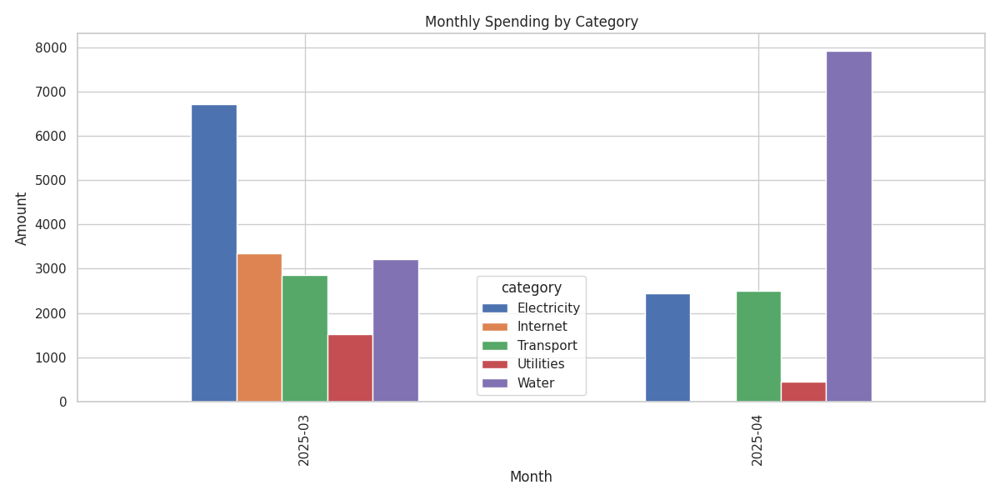
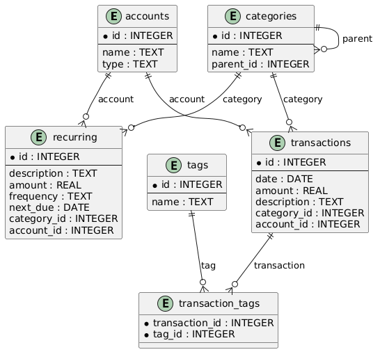

# 🧾 Personal Finance Tracker

This is a **Personal Finance Tracker** built using **Python**, **SQLite**, and **Pandas** to demonstrate skills in relational databases, data analysis, and structured schema design. It allows you to manage expenses, categorize transactions, tag them, and analyze spending patterns.

## 🚀 How to Run

1. Install dependencies

```bash
python3 -m venv .env 
source .env/bin/activate 
pip3 install -r requirements.txt
```

2. Initialize the database and Populate with sample data:

```bash
python populate.py
```

3. Run analytics:
```bash
python analysis.py
```

4. Stop the environment
```bash
deactivate
```

## 📸 Screenshot

Here's an example of the **monthly spending breakdown by category** generated by the `analysis.py` module:



## 📐 Schema Design (UML)

This project uses a well-structured relational schema to capture different aspects of personal finance. The design ensures flexibility, normalization, and real-world applicability.

### 💼 Accounts

Each transaction is tied to an account, such as a bank account, credit card, cash, or wallet. We separate accounts into a distinct table to support:

- Multiple sources of funds
- Future account-level analysis (e.g., spending by account)
- Flexibility to add new account types

### 🗂️ Categories

Transactions are organized into categories like "Groceries", "Utilities", or "Entertainment". To model nested subcategories (e.g., "Utilities → Internet"), we use a self-referencing foreign key (parent_id). This allows:

- Hierarchical budgeting
- Flexible aggregation at multiple levels
- Cleaner UI/UX later (e.g., category trees)

### 💸 Transactions

The central table of the schema, where each transaction logs:

- Date, amount, description
- Foreign keys to account and category
- This links financial activity with its source and purpose

### 🔁 Recurring

Bills like rent, subscriptions, and utilities are often repetitive. The recurring table models these with:

- Description, amount, frequency (e.g., monthly, weekly)
- Associated account and category
- Future automation: we can auto-generate transactions from these templates

### 🏷️ Tags and TransactionTags

We allow tagging transactions with custom labels like "urgent", "reimbursable", or "tax-deductible". This uses:

- A tags table
- A many-to-many bridge table transaction_tags
- This design gives extra flexibility for filtering and analysis beyond categories (e.g., "Show all urgent expenses this month").



## ⚙️  CRUD Operations

The crud.py module provides full Create, Read, Update, and Delete operations for all entities:

- Accounts: Add multiple types (cash, debit, credit, investment)
- Categories: Support for nested categories (e.g., "Utilities" → "Electricity")
- Transactions: Log each transaction with account and category links
- Recurring: Model monthly/weekly subscriptions or bills
- Tags: Label and filter transactions
- TransactionTags: Many-to-many linking between tags and transactions

Each function connects to the SQLite database and executes the necessary SQL queries under the hood.

## 📥 Sample Data Population

The populate.py script fills the database with realistic sample data:

- A variety of accounts and nested categories
- Several recurring bills (like rent and internet)
- 30 days of random daily transactions
- Tags like "monthly", "urgent", and "reimbursable" assigned to some transactions
- This makes the database rich enough for meaningful analytics.

## 📊 Data Analysis with Pandas

The `analysis.py` script loads data from SQLite and converts it to **Pandas DataFrames** for flexible analysis and visualization:

- 📅 Recent transactions
- 📊 Monthly spending by category and by account
- 💰 Total spending per account
- 📈 Charts to show spending trends

## 🧰 Tools Used

|         Tool         |                   Role                   |
|:--------------------:|:----------------------------------------:|
| SQLite               | Lightweight embedded relational database |
| Pandas               | Data manipulation and analysis           |
| Matplotlib / Seaborn | Visualization                            |
| Python               | Glue for all components                  |

## 📁 Folder Structure

```pgsql
.
├── analysis.py     # Pandas-based insights and plots
├── crud.py         # Create/Read/Update/Delete operations for all tables
├── finance_tracker.db # Generated SQLite DB
├── Images
│   └── monthly_spending_by_category.png # Sample Screenshot of Analysis
├── populate.py     # Fills database with realistic test data
├── README.md       # Project documentation
├── requirements.txt # List of python dependencies
├── schema.py       # Create and initialize the SQLite schema
└── UML             # Contains uml diagram for our schema
    ├── schema.uml
    └── uml.png
```
