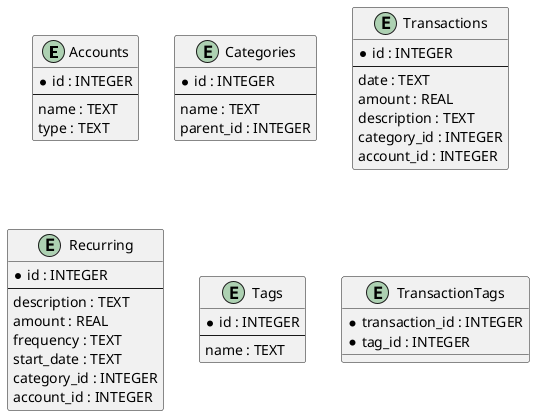

# 🧾 Personal Finance Tracker

This is a **Personal Finance Tracker** built using **Python**, **SQLite**, and **Pandas** to demonstrate skills in relational databases, data analysis, and structured schema design. It allows you to manage expenses, categorize transactions, tag them, and analyze spending patterns.

---

## 🚀 How to Run

1. Install dependencies

```bash
python3 -m venv .env 
source .env/bin/activate 
pip3 install -r requirements.txt
```

2. Initialize the database and Populate with sample data:

```bash
python populate.py
```

3. Run analytics:
```bash
python analysis.py
```

4. Stop the environment
```bash
deactivate
```

## 📸 Screenshot

Here's an example of the **monthly spending breakdown by category** generated by the `analysis.py` module:


## 📐 Schema Design (UML)

The schema is designed to capture multiple aspects of personal finance, including hierarchical categories, accounts, recurring bills, and tags for rich filtering.



## ⚙️  CRUD Operations

The crud.py module provides full Create, Read, Update, and Delete operations for all entities:

- Accounts: Add multiple types (cash, debit, credit, investment)
- Categories: Support for nested categories (e.g., "Utilities" → "Electricity")
- Transactions: Log each transaction with account and category links
- Recurring: Model monthly/weekly subscriptions or bills
- Tags: Label and filter transactions
- TransactionTags: Many-to-many linking between tags and transactions

Each function connects to the SQLite database and executes the necessary SQL queries under the hood.

## 📥 Sample Data Population

The populate.py script fills the database with realistic sample data:

- A variety of accounts and nested categories
- Several recurring bills (like rent and internet)
- 30 days of random daily transactions
- Tags like "monthly", "urgent", and "reimbursable" assigned to some transactions
- This makes the database rich enough for meaningful analytics.

## 📊 Data Analysis with Pandas

The `analysis.py` script loads data from SQLite and converts it to **Pandas DataFrames** for flexible analysis and visualization:

- 📅 Recent transactions
- 📊 Monthly spending by category and by account
- 💰 Total spending per account
- 📈 Charts to show spending trends

## 🧰 Tools Used

|         Tool         |                   Role                   |
|:--------------------:|:----------------------------------------:|
| SQLite               | Lightweight embedded relational database |
| Pandas               | Data manipulation and analysis           |
| Matplotlib / Seaborn | Visualization                            |
| Python               | Glue for all components                  |

## 📁 Folder Structure

```pgsql
.
├── analysis.py     # Pandas-based insights and plots
├── crud.py         # Create/Read/Update/Delete operations for all tables
├── finance_tracker.db # Generated SQLite DB
├── Images
│   └── monthly_spending_by_category.png # Sample Screenshot of Analysis
├── populate.py     # Fills database with realistic test data
├── README.md       # Project documentation
├── requirements.txt # List of python dependencies
├── schema.py       # Create and initialize the SQLite schema
└── UML             # Contains uml diagram for our schema
    ├── schema.uml
    └── uml.png
```
